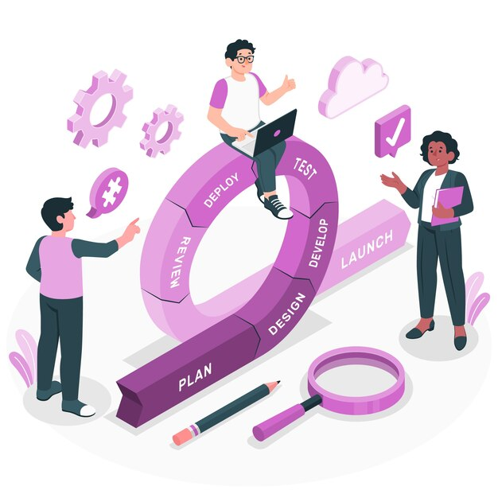

<!-- new slide -->

# Analyse

{:width="50%"}*figure: Analyse*

<!-- note -->

Dans ce chapitre consacré à l'analyse du projet CNMH, nous plongeons dans l'examen approfondi des différentes facettes qui ont guidé la conception et le développement de l'application. Nous explorerons les méthodologies, les processus et les outils utilisés pour comprendre les besoins du Centre National Mohammed VI des Handicapés (CNMH) et y répondre de manière optimale. En mettant en lumière les démarches agiles telles que le Design Thinking et le processus 2TUP, ainsi que les choix technologiques stratégiques, nous découvrirons comment ces éléments ont été intégrés pour façonner une solution adaptée et efficace.

<!-- new slide -->

## Développement agile

{:width="40%"}*figure: Développement agile*

<!-- note -->

La méthode agile, également connue sous le nom de développement agile ou gestion de projet agile, est une approche itérative et collaborative de la gestion de projets et de développement logiciel. Elle met l'accent sur l'adaptabilité, la flexibilité et la livraison continue de produits ou de fonctionnalités.

<!-- new slide -->

## Processus de développement

{:width="40%"}*figure: Processus de développement*

<!-- note -->

## 2TUP

Le développement logiciel suit une méthodologie structurée pour concevoir ou améliorer un système logiciel. Ce chapitre se découpe en deux sections : la première explore le 2TUP (Two-Track Unified Process), tandis que la seconde se concentre sur le Design Thinking.

- 2TUP est un processus de développement logiciel qui implémente le Processus Unifié.
- Il commence par une étude préliminaire qui consiste essentiellement :
    - Identifier les acteurs qui vont interagir avec le système à construire
    - Cahier des charges 
    - Modéliser le contexte

- Le processus s'articule ensuite autour de 3 phases essentielles :
    - Une branche technique
    - Une branche fonctionnelle
    - Une phase de réalisation

- **Branche fonctionnelle :** qui consiste en la modélisation et le maquettage pour clarifier les besoins fonctionnels.

- **Branche Technique :** qui recense toutes les contraintes à respecter pour réaliser le système Elle définit ensuite les composants nécessaires à la construction de l’architecture technique.

- **La phase de réalisation :** consiste à réunir les deux branches, permettant de mener une conception applicative et enfin la livraison d'une solution adaptée aux besoins. Arrive par la suite l’étape de codage et enfin l’étape de recette, qui consiste à valider les fonctions du système développé.

## Design thinking

Le design thinking est une approche centrée sur l'humain pour résoudre des problèmes complexes et développer des solutions innovantes. Il met l'accent sur l'empathie, la collaboration multidisciplinaire, l'expérimentation et l'itération rapide.
Les étapes de design thinking : 

- **Empathie :**

Comprendre les besoins et les perspectives des utilisateurs concernés par le problème à résoudre. Cela implique d'observer, d'écouter et d'interagir avec les utilisateurs pour acquérir une compréhension approfondie de leurs besoins, motivations et défis.

- **Définir le problème :**

Définir clairement le problème à résoudre en se basant sur les informations recueillies lors de la phase d'empathie. Il s'agit de formuler une question ou un défi spécifique qui orientera le processus de conception.

- **Idéation :**

Générer un grand nombre d'idées créatives pour aborder le problème identifié. Encourager la pensée divergente, où toutes les idées sont les bienvenues, sans jugement, afin de favoriser l'exploration de différentes solutions possibles.

- **Prototype :** 

Créer des prototypes tangibles ou des représentations visuelles des solutions potentielles. Les prototypes peuvent être simples et rapides à réaliser, mais doivent être suffisamment concrets pour recueillir des retours et les itérer.

- **Test :**

Tester les prototypes auprès d’utilisateurs réels. Les premières maquettes comportent nécessairement des erreurs, qu’il faut identifier au plus vite et dont il faut ensuite tirer des enseignements.

<!-- new slide -->

