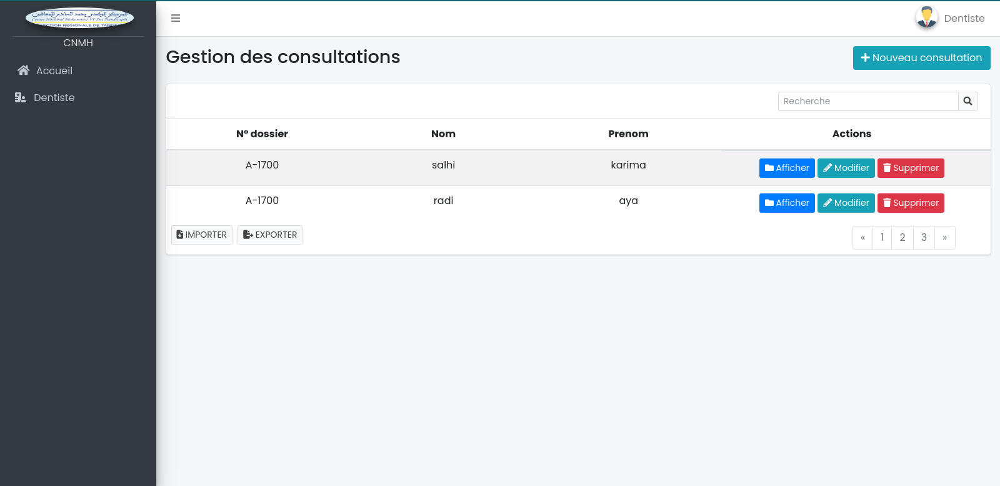
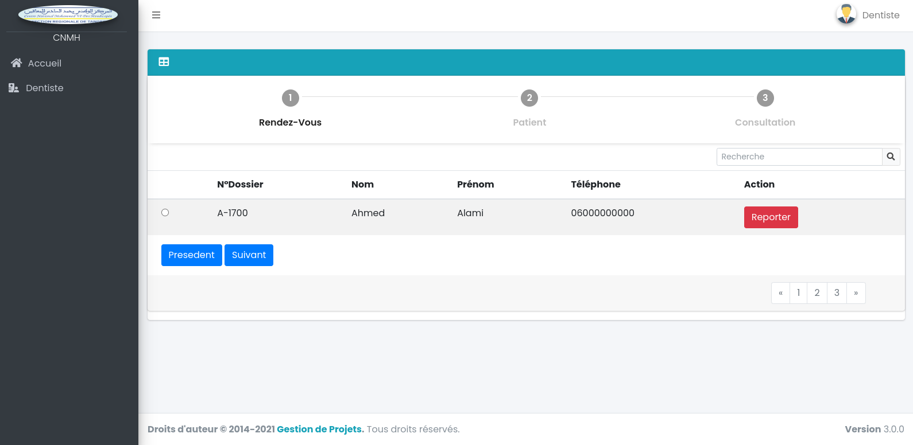
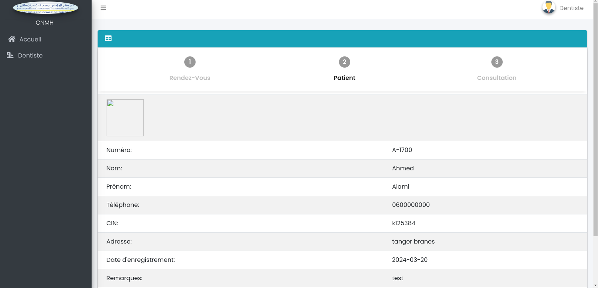
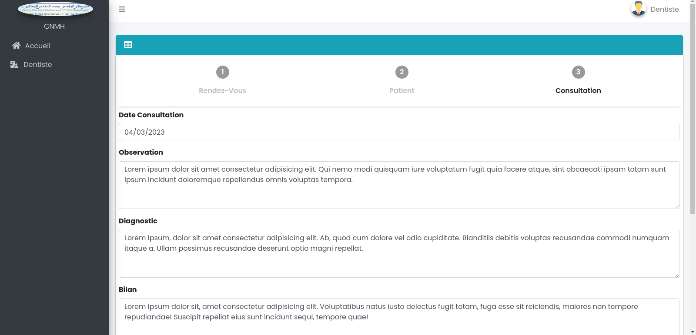
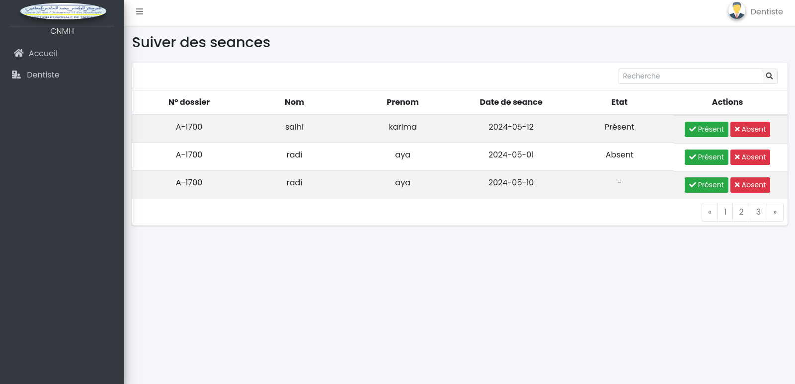

<!-- new slide -->

# Conception

{:width="35%"}*figure: Conception*

<!-- new slide -->

## Diagramme de classe global

{:width="65%" .dgGlobal}*figure: Diagramme de classe global*

<!-- new slide -->

## Diagramme de classe Pôle médical

{:width="65%"}*figure: Diagramme de classes Pôle médical*

<!-- new slide -->

## Les maquettes de dentiste

{:width="65%"}*figure: Liste des consultations*

<!-- new slide -->

## Le maquette de dentiste rendez vous

{:width="65%"}*figure: Liste des rendez vous*

<!-- new slide -->

## Le maquettes de dentiste patient infos

{:width="65%"}*figure: Patient info*

<!-- new slide -->

## Le maquettes formulaire de cinsultation de dentiste 

{:width="65%"}*figure: Formulaire de consultation*

<!-- new slide -->

## Le maquettes detail de consultation de dentiste 

{:width="65%"}*figure: Detail de consultation*

<!-- new slide -->

## Le maquettes suivez des seances de dentiste 

{:width="65%"}*figure: Suiver des seances*

