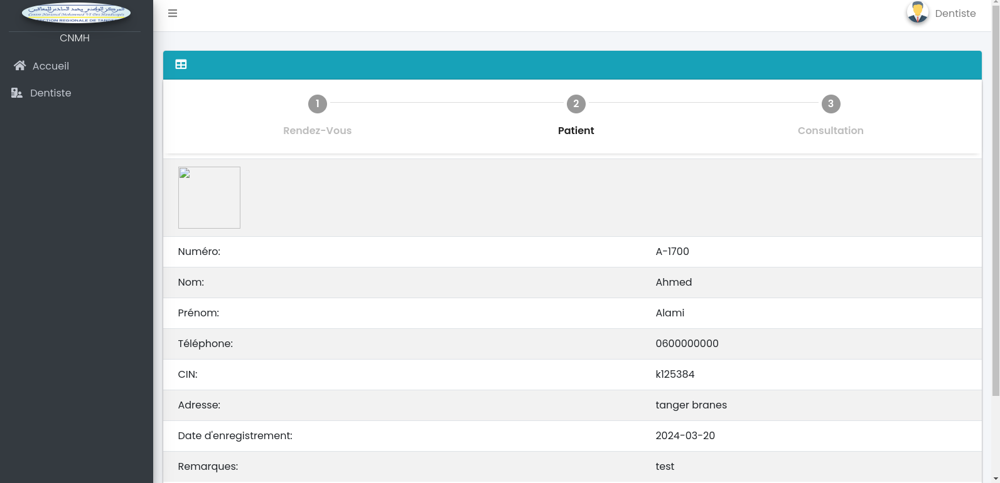

<!-- new slide -->

# Diagramme de classes

{:width="65%"}*figure: Diagramme de classes*

<!-- new slide -->

## Les maquettes de dentiste

{:width="65%"}*figure: Liste des consultations*

<!-- new slide -->

## Le maquette de dentiste rendez vous

{:width="65%"}*figure: Liste des rendez vous*

<!-- new slide -->

## Le maquettes de dentiste patient infos

{:width="65%"}*figure: Patient info*

<!-- new slide -->

## Le maquettes formulaire de cinsultation de dentiste 

{:width="65%"}*figure: Formulaire de consultation*

<!-- new slide -->

## Le maquettes detail de consultation de dentiste 

{:width="65%"}*figure: Detail de consultation*

<!-- new slide -->

## Le maquettes suivez des seances de dentiste 

{:width="65%"}*figure: Suiver des seances*

<!-- new slide -->

