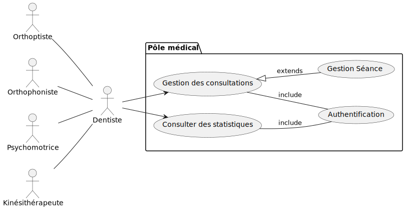

<!-- new slide -->

## Idéation

{:width="50%"}*figure: Idéation*

<!-- note -->

- Utiliser une application de gestion pour automatiser la saisie des données, la gestion des rendez-vous et la coordination entre services pour réduire la charge administrative.

<!-- new slide -->

## Diagramme de cas d'utilisation 

{:width="70%"}*figure: Diagramme de cas d'utilisation*

